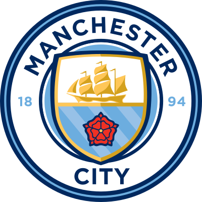
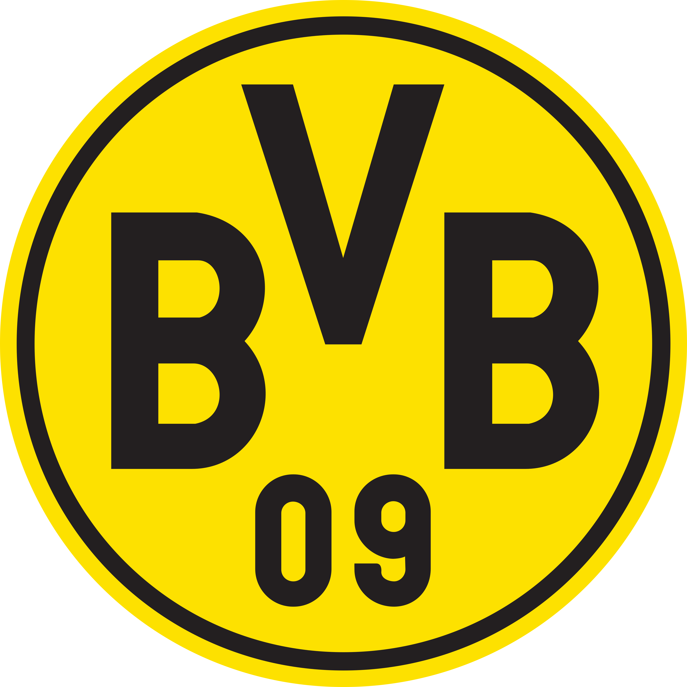
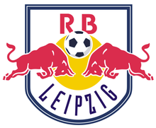
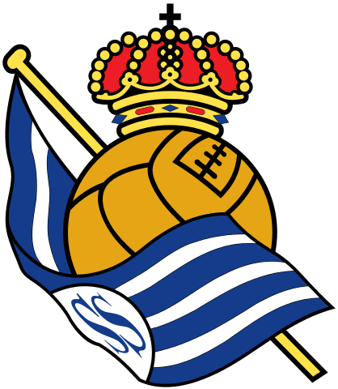
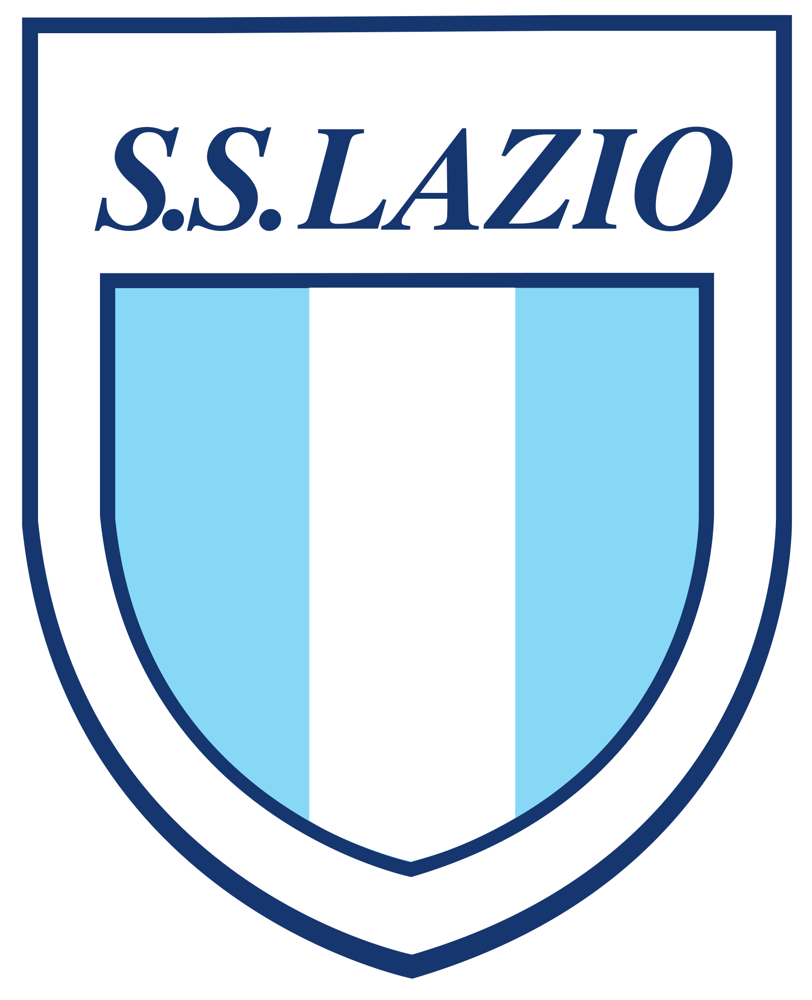

# SORTEADOR FIFA

# Funcionalidade

Existem 30 times cadastrados no total, cada time é um objeto, tendo no seu interior:

- Nome
- Emblema
- País
- Liga
 
 

Eles estão distribuidos em três grupos sendo os seguintes times em cada grupo.

<h1>TIER A<h1>

<h1>TIER B<h1>

<h1>TIER C<h1>

 

# Funcionalidade

No site temos 4 times de sorteio, sendo eles.

- Tier A (Sorteio entre os times do grupo A)
- Tier B (Sorteio entre os times do grupo B)
- Tier C (Sorteio entre os times do grupo C)
- Random (Sorteio aleatório entre todos os times)
